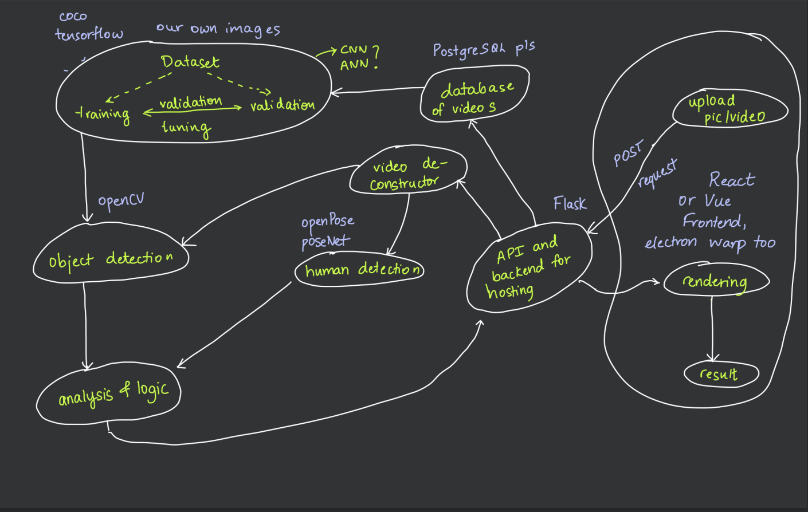

# 🥏 frizTracker
I love ultimate. I love computer vision. There is nothing else that can intersect these two the best. Tune in to find out.

#### Getting started
* Make sure that flask is installed ONLY on your virtualenv for this app. Flask will redirect to your local pip installation of flask when running the backend, so make sure that you have uninstalled any local flask package in your local pip directory.

* I will think of a better way to deploy venv dependencies. Long gone is the age of using a requirements.txt to establish dependencies. A pipfile ought to do for setup.

#### Structure

#### Thoughts for us devs
* Do we want to dockerize this? If so, how do we dockerize this? Maybe a redis queue? ML image, backend image, postgres image, redis image??
* Should I follow every fiber in my being that is telling me to screw React and go back to Vue to and get all cozy with my cushy chushy comfortabilities or shoud I ball out and just die learning React
* Will we need workers?
* CI/CD for something like this is overkill
